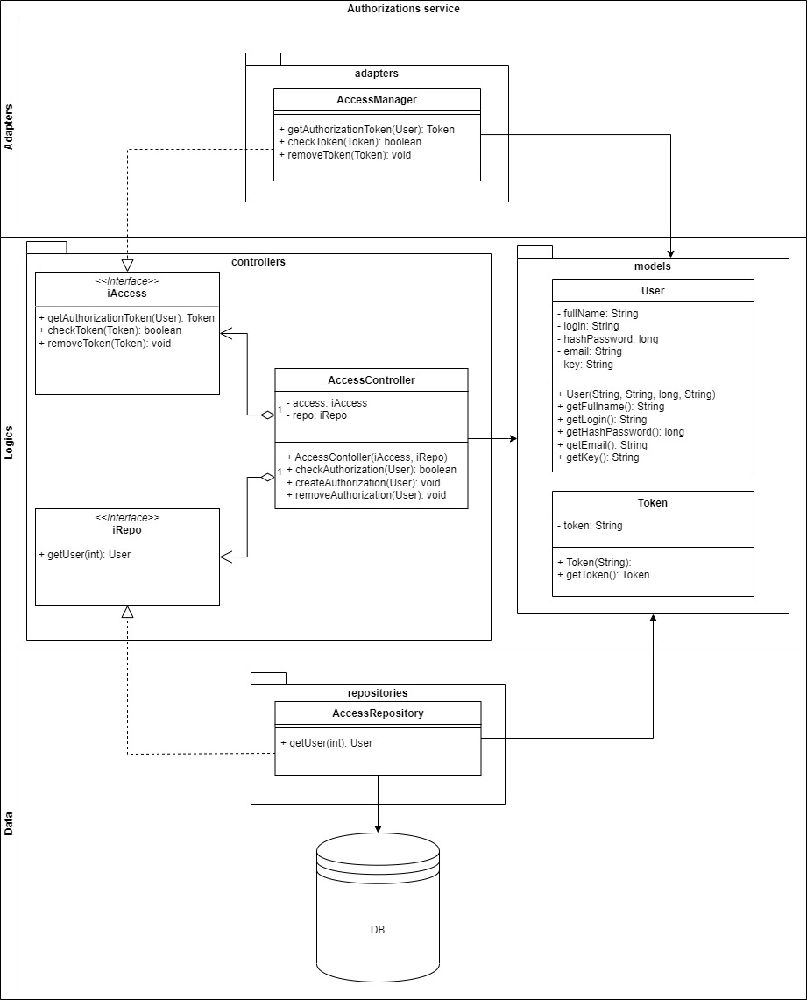

## Архитектура ПО (семинары)
Урок 11. Сервис-ориентированные архитектуры

Инструменты:

https://app.diagrams.net/
https://grafana.com/
https://prometheus.io/

## Homework
Для проекта системы управления роботом-пылесосом разработать:

ERD диаграмма данных хранимых в облаке:

ERD_robot_vacuum_cleaner

 UML диаграмма микро сервиса аутентификации на основе токенов безопасности.

UML_micro_authentication_service

